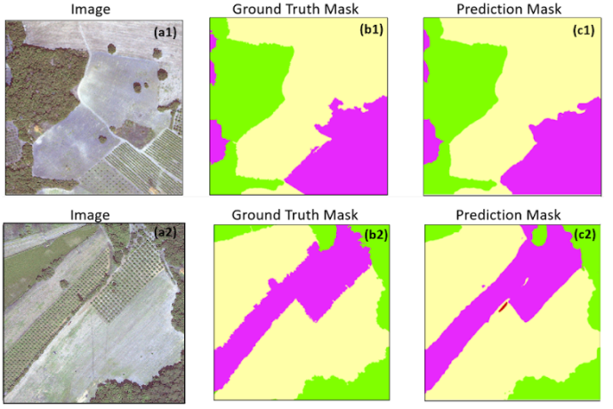
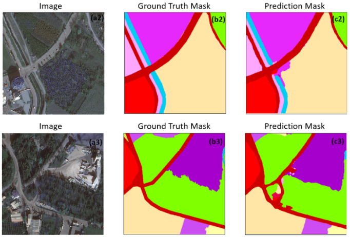

# A MULTI-TASK DEEP LEARNING FRAMEWORK FOR BUILDING FOOTPRINT SEGMENTATION
This repository contains the code for the paper [Land Use and Land Cover Mapping Using Deep Learning Based Segmentation Approaches and VHR Worldview-3 Images]([PLACEHOLDER])

Framework
---------------------
The framework of this study is detailed as follow. 

Outputs
---------------------

Dataset and Weights
---------------------
| Dataset            | Model | F-1 Score | IoU | Weights |
|:--------------------------:|:------------------:|-------------------------:|-------------------------:| -------------------------:|
|Aksu                       | DeepLabv3+ Resnext-50_32x_4d             | 94.35  | 89.46 |weights](https://drive.google.com/drive/folders/146HRDz-075PTf-pyUQO-1ZrU4X1UQ5L2)                   |
|Kestel                         | DeepLabv3+ Resnext-50_32x_4d                | 89.65  | 89.76 |                      | [weights](https://drive.google.com/drive/folders/146HRDz-075PTf-pyUQO-1ZrU4X1UQ5L2)                 |
|Aksu + Kestel Combined                       | DeepLabv3+ Resnext-50_32x_4d                 | 92.85  | 92.83 |                    | [weights](https://drive.google.com/drive/folders/146HRDz-075PTf-pyUQO-1ZrU4X1UQ5L2)   

System-specific notes
---------------------
The code was implemented in Python(3.8) and PyTroch(1.14.0) on Windows OS. The *segmentation models pytorch* library is used as a baseline for implementation. Apart from main data science libraries, RS-specific libraries such as GDAL, rasterio, and tifffile are also required.

Citation
---------------------
Please kindly cite our paper if this code and the dataset used in the study is useful for your research.

[PLACEHOLDER]
